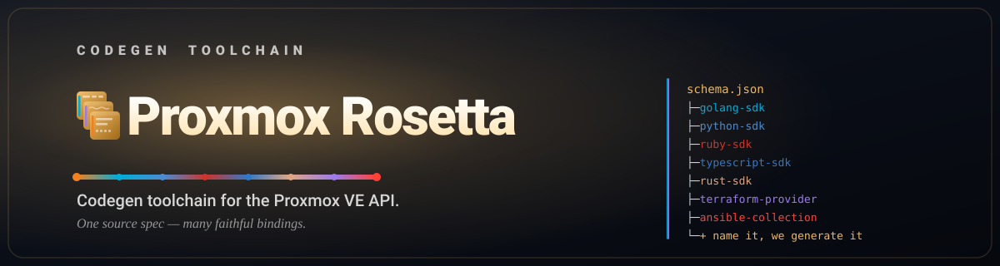

  

<h3 align="center">One source spec, many faithful bindings.</h3>

  
  
  

Built with ❤️ for the Proxmox community.

  &nbsp;&nbsp;

> [!NOTE]
> The repositories are being prepared for their public release.

## About

[Proxmox VE](https://www.proxmox.com/en/proxmox-ve) does not publish a
machine-readable OpenAPI specification for its REST API. Proxmox Rosetta
extracts the schema from the signed, versioned PVE packages, validates it into
a stable JSON specification, and generates client libraries and infrastructure
tooling from it. All targets are regenerated together, with one release per
pinned PVE schema version.

## Projects

| Category | Project | Description | Maintenance |
|---|---|---|---|
| Toolchain | `rosetta` | Schema extraction and code generators | Hand-maintained |
| SDKs | `golang-sdk` | Go client | Generated |
| | `python-sdk` | Python client with type hints | Generated |
| | `typescript-sdk` | TypeScript client | Generated |
| | `rust-sdk` | Rust client | Generated |
| | `ruby-sdk` | Ruby client with RBS types | Generated |
| Infrastructure | `terraform-provider-proxmox` | Terraform provider | Generated |
| | `ansible-collection` | Ansible collection | Generated |
| CI | `fleeting-plugin-proxmox` | [GitLab Runner fleeting](https://docs.gitlab.com/runner/fleet_scaling/fleeting/) plugin for autoscaling CI job VMs | Hand-maintained |

Generated projects are produced by `rosetta` from the PVE schema; each SDK
covers all 680 endpoints. Hand-maintained projects are developed and released
independently.

## Support

  Built with ❤️ for the Proxmox community. 
  If these tools make your day a little easier, you can say thanks here:

  &nbsp;&nbsp;

